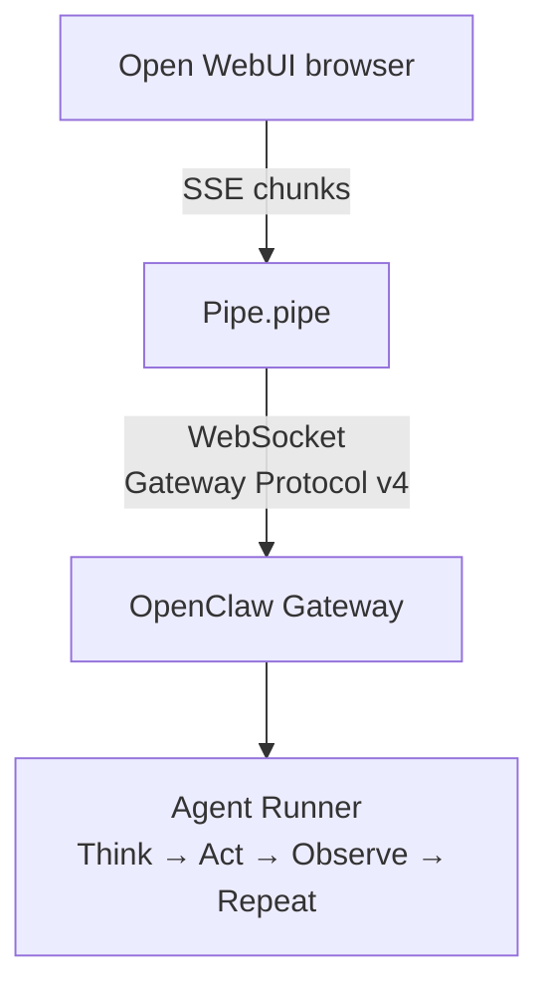

# OpenClaw Pipe for Open WebUI

[](https://github.com/unithejerk/claw-ui/actions/workflows/ci.yml)
[](LICENSE)
[](https://www.python.org/)

Use [OpenClaw](https://openclaw.ai) agents directly in
[Open WebUI](https://openwebui.com) — selectable from the model dropdown,
streaming token-by-token, with tool calls rendered as native cards.

## Why

The Gateway's OpenAI-compatible HTTP endpoint is a compatibility surface —
stateless, lossy, and disabled by default. This Pipe speaks the Gateway's
**native WebSocket RPC protocol**, which is the documented primary path for
external applications. You get session continuity, streaming agent events,
tool visibility, and proper error semantics — things the HTTP API strips
away.

| | This Pipe | OpenAI HTTP API |
|---|---|---|
| Protocol | Gateway RPC over WebSocket (v4) | `/v1/chat/completions` |
| Session model | Stateful — conversation persists across messages | Stateless by default |
| Tool calls | `<details>` cards with arguments and results | `tool_calls` deltas (retry-loop risk) |
| Approval | 4 modes including interactive browser dialogs | No approval surface |
| Agent discovery | Auto-discover via `agents.list` RPC | Manual model IDs |
| Streaming | Per-token deltas + thinking + status events | Chunked text only |
| Auth | Operator token (token-only, no keypair setup) | Full operator access |

## Quickstart

### 1. Start the Gateway

```bash
openclaw gateway start
# Listening on ws://127.0.0.1:18789 (default)
```

New to OpenClaw? Start with the [Gateway docs](https://docs.openclaw.ai).

### 2. Generate a token

```bash
openclaw gateway token create --scopes operator.read,operator.write,operator.approvals
```

### 3. Install the Pipe

Direct install — pushes straight to a running Open WebUI instance via its
REST API (stdlib-only, no extra deps needed on the machine running the
installer):

```bash
python3 install.py \
    --owui-url http://localhost:3000 \
    --owui-key sk-your-admin-api-key \
    --valves '{"GATEWAY_URL":"ws://127.0.0.1:18789","GATEWAY_TOKEN":"..."}'
```

Find your API key at **Settings → Account → API Keys** in Open WebUI. Omit
`--valves` to be prompted interactively instead.

Manual install — generate a bundle, then paste it into **Workspace →
Functions → + → Pipe**:

```bash
python3 install.py -o openclaw_pipe_bundle.py
```

### 4. Select a model

Open a new chat, pick **OpenClaw/Default** from the model selector, and
send a message. The Pipe auto-discovers available agents on first use.

## Features

### User-facing

- **Streaming responses** — tokens appear as the agent generates them,
  with thinking/reasoning shown as status events
- **Tool call cards** — shell commands, web searches, and file operations
  render as expandable HTML cards in chat, with arguments and results
- **Interactive approvals** — when an agent needs permission to run a tool,
  a browser confirmation dialog pauses the Pipe until you click Approve or
  Deny (requires recent Open WebUI)
- **Session continuity** — each chat keeps its own Gateway session; return
  to a conversation and the agent remembers context
- **File attachments** — upload files in chat and they're forwarded to the
  agent

### Admin-facing

- **Agent discovery** — set `AGENT_LIST` to `__auto__` and the Pipe
  discovers available agents from the Gateway at runtime. Pin a static
  list (`"default,coding,research"`) if you prefer
- **Live configuration** — all valves (URL, token, approval mode,
  timeouts) editable in the UI with no restart
- **OpenTelemetry** — traces, metrics, and logs with zero config when
  OWUI has `ENABLE_OTEL=true`. Standalone mode available otherwise.
  Degrades to silent no-ops when OTel packages aren't installed
- **Reconnection** — exponential backoff on WebSocket disconnect; survives
  Gateway restarts

### Approval modes

| Mode | Behavior |
|---|---|
| `auto_deny` | All approvals rejected. Chat shows a note. **(default — safe)** |
| `auto_approve` | All approvals granted silently. For trusted environments. |
| `render` | Shows an approval card, then auto-denies after `APPROVAL_TIMEOUT` seconds. |
| `interactive` | Browser confirmation dialog. Pipe pauses until user responds. Falls back to auto-deny on older OWUI. |

## Architecture



## Project layout

| File | Role |
|---|---|
| `openclaw_pipe.py` | Pipe entry point — `pipes()` / `pipe()` |
| `gateway_client.py` | WebSocket client — connect, RPC, streaming, reconnect |
| `protocol.py` | Gateway Protocol v4 frame types, parsers, constructors, auth |
| `event_mapper.py` | Gateway events → OWUI SSE chunk translation |
| `valves.py` | Pydantic config schema (12 fields with validation) |
| `telemetry.py` | OTel traces + metrics + logs (no-op when disabled) |
| `install.py` | Bundler + OWUI REST API installer (stdlib-only) |
| `debug_events.py` | Standalone diagnostic — connect and dump raw Gateway frames |

## Requirements

- Open WebUI with Pipe Function support
- Python packages: `pydantic >= 2.0`, `websockets >= 12.0` (both ship with
  Open WebUI)
- OpenClaw Gateway running and reachable

## Docs

- [Architecture overview](docs/architecture.md)
- [Configuration guide](docs/configuration.md) — all valves, OTel setup,
  troubleshooting
- [Protocol mapping](docs/protocol-mapping.md) — Gateway concepts → OWUI
  equivalents
- [Integration report](docs/integration-report.md) — why Pipe + Gateway RPC
  was chosen over alternatives

## Limitations

- **Token-only auth** — the Pipe authenticates with `auth.token` only, no
  Ed25519 device keypair or challenge signing. The Gateway exemption for
  `mode: "backend"` on loopback connections means this works fine when OWUI
  and the Gateway run on the same host. If the Gateway is in a Docker
  container without host networking, or on a different machine, the
  connection won't appear as loopback and you'll get a
  `DEVICE_AUTH_NONCE_REQUIRED` error. The signing helpers exist in
  `protocol.py` (`sign_challenge`, `_derive_device_id`) and
  `debug_events.py` exercises the full Ed25519 path — they're just not
  wired into the Pipe yet
- **Single Gateway** — one Pipe targets one Gateway URL (no failover or
  multi-Gateway routing)

## Future work

- **Ed25519 device auth** — wire the challenge-signing helpers already in
  `protocol.py` into the connect handshake so the Pipe can talk to Gateways
  on non-loopback hosts (Docker bridge networks, remote machines). Needs a
  keypair persistence strategy — likely a `DEVICE_KEYPAIR` valve or file
  under Open WebUI's data directory — and either `pynacl` or a bundled
  pure-Python Ed25519 implementation to avoid adding a dependency
- **Multi-Gateway routing** — spread agent runs across multiple Gateway
  instances with failover on disconnect

## Contributing

Issues and PRs welcome. See [CONTRIBUTING.md](CONTRIBUTING.md) for setup,
testing, and code style. Vulnerabilities → [SECURITY.md](SECURITY.md).

## License

MIT — see [LICENSE](LICENSE).
